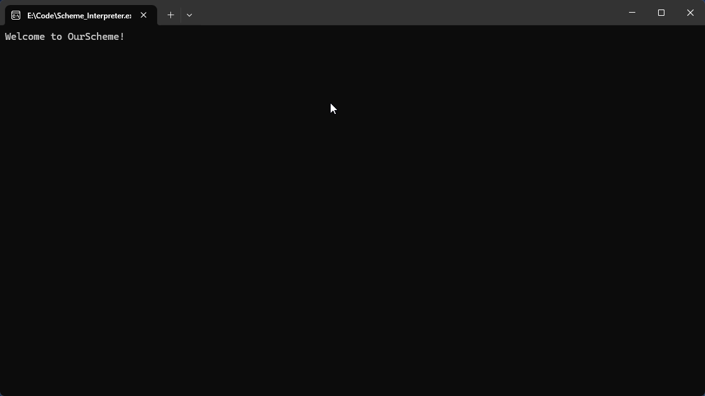
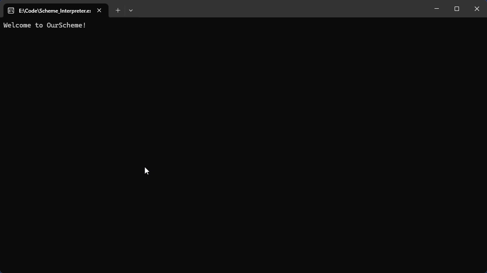
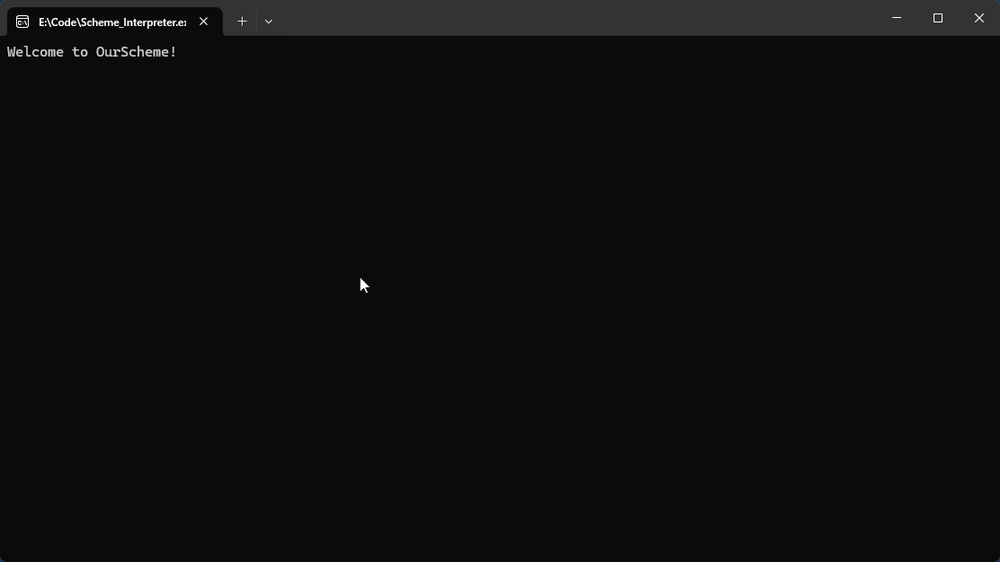
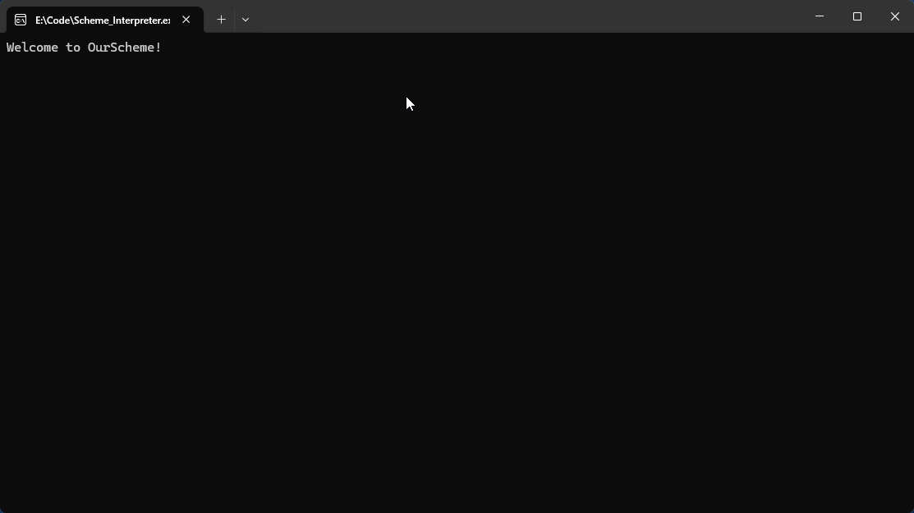
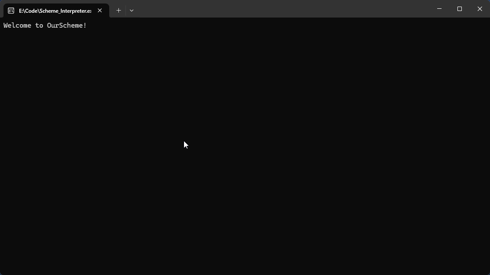
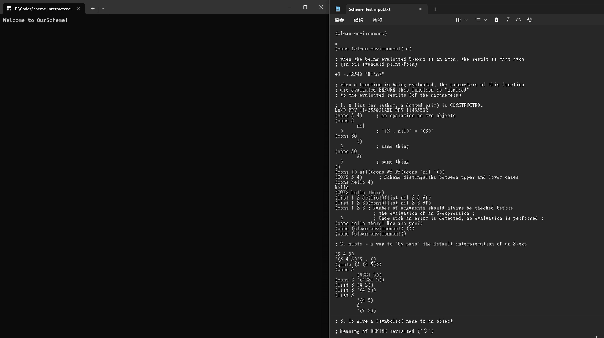

# OurScheme - Interpreter for Scheme 的介紹：

---

# 1. 什麼是 Scheme？

Scheme 是一種 Lisp 家族的程式語言，其最大特色是語法極度簡潔，並且以 S-expression（符號運算式） 作為程式的基本結構。
在 Scheme 中，所有程式與資料都以 S-expression 表示，這樣的設計使得 Scheme 非常適合用來學習：

- 程式語言設計
- 語法分析（Parsing）
- 直譯器與編譯器的基礎原理

關於 Scheme 的背景介紹，可參考維基百科：
👉 https://zh.wikipedia.org/wiki/Scheme

---

# 2. 這個程式可以做到什麼？

本專案實作了一個 Scheme-like 系統的前端（Front-end），主要目標在於：

👉 讀取、解析、檢查並印出 S-expression

具體來說，這個程式可以：

1. 從標準輸入讀入 Scheme 指令
    - 正確處理：
        - 行註解（; 開頭）
        - 跨行輸入的指令
        - 巢狀的 S-expression
 
2. 將輸入切割成 token（詞彙分析）
3. 根據 OurScheme 規範檢查指令是否符合語法
    - 當發生語法錯誤時：
        - 指出錯誤種類
        - 顯示錯誤發生的 行號與欄位

    - 當語法正確時：
        - 建立對應的 S-expression 資料結構
        - 以 Pretty Print 的方式將結構化結果輸出

---
  
# 3. Scheme 的三種表達式（S-expression 分類）

從語法結構的角度來看，Scheme 中的所有輸入都屬於 S-expression，而 S-expression 可粗分為以下三類：

- atom
- ' expression
- ( expression )

```
  Syntax of OurScheme :

  <S-exp> ::= <ATOM> 
            | LEFT-PAREN <S-exp> { <S-exp> } [ DOT <S-exp> ] RIGHT-PAREN
            | QUOTE <S-exp>
            
  <ATOM>  ::= SYMBOL | INT | FLOAT | STRING 
            | NIL | T | LEFT-PAREN RIGHT-PAREN
```
---

# 3-1. Atom

Atom 是 最基本、不可再分解的表達式，不使用括號。
由 Syntax 可以得知 atom 分為 :

```
  <ATOM>  ::= SYMBOL | INT | FLOAT | STRING 
            | NIL | T | LEFT-PAREN RIGHT-PAREN
```

- 數值
    - INT : '123', '+123', '-123'
    - FLOAT : '123.567', '123.', '.567', '+123.4', '-.123'
    


- 字串
    - STRING (strings do not extend across lines) : "hello", "Watch me"
    
- 符號
    - SYMBOL : 非數值，字串，布與空值，也不包含單雙引號，分號
    
- 布林與空值
    - true ： #t, t
    - false / 空串列 ： nil, (), #f, f
    
---

# 3-2. ' expression

以單引號 ' 開頭的表達式稱為 Quoted Expression，表示：

``` diff
<S-exp> ::= <ATOM> 
            | LEFT-PAREN <S-exp> { <S-exp> } [ DOT <S-exp> ] RIGHT-PAREN
+           | QUOTE <S-exp>    
```
    
    將後面的 expression 視為「資料本身」，而非要進行運算的指令。
    注 : ' expression 等價 ( quote expression )

---

# 3-3. ( expression )

以一對括號包起來的表達式，是 Scheme 中最常見的結構形式。

``` diff
<S-exp> ::= <ATOM> 
+           | LEFT-PAREN <S-exp> { <S-exp> } [ DOT <S-exp> ] RIGHT-PAREN 
            | QUOTE <S-exp>    
```

括號表達式可用來表示：
- 串列（List）
- 點對（Dotted Pair）
- 巢狀結構

---

# 4. 錯誤處理機制

本程式能偵測並回報多種語法錯誤，包括：

- 非預期的 token
- 缺少右括號 )
- 字串未正確關閉，左括號 '(' 缺少對應的 ')' 

當錯誤發生時，系統會輸出：

- 錯誤類型
- 發生的行號（ Line ）
- 發生的欄位（ Column ）
- 對應的錯誤 token

---

# 5. 語法與已實作指令

若想更深入了解：

- 本程式所遵循的語法規則（Grammar）
- token 的定義
- 已實作的 Scheme 指令與內建函式

請參考專案資料夾中的以下文件：

```
scheme/
├── 原始文件/
│   ├── OurSchemeProj1-UTF-8.txt
│   └── OurSchemeProj2-UTF-8.txt
└── Implement commands.txt
```

這些文件詳細說明了本專案所支援的語法與功能範圍。

---
# 6. 總結

本專案展示了 Scheme 系統中最核心的基礎技術，包括：

- 詞彙分析（Lexical Analysis）
- S-expression 語法解析（Parsing）
- 語法錯誤檢查 (Syntax Erroe Detection)
- 結構化輸出（Pretty Printing）

---
    
# QA Session :

## 為什麼我在按下 enter 以後，程式沒有反應？

    會出現這種情況，只有一種可能，截至 enter 為止，你的command 都合乎文法，  
    但是程式並沒有等到預期的結尾，所以這段 command 並認定為尚未 key 完的 command，  
    那因為有支援 cross line command，所以你只要把預期的結尾補足，相信就能看到 output.

---

# Demo

在程式剛開始的時候，要輸入一個 int 數字，這是為了方便 debug，去抓testcase。 

---

##  Define



---

## test case demo 


    
    
